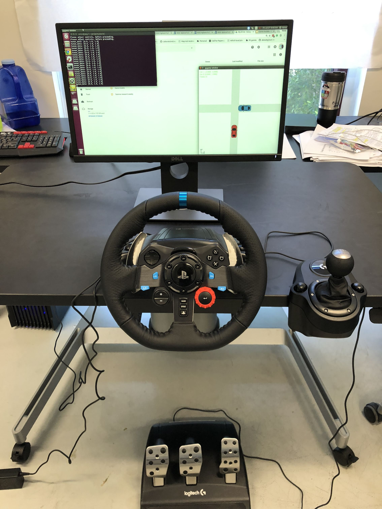
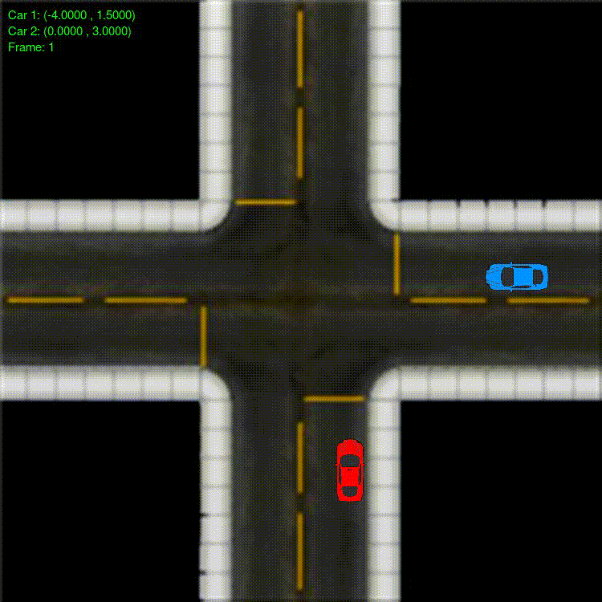

# Driving simulation with social graceful autonomouse vehicle

Contributors: Steven Elliott, Yiwei Wang, Varun Jammula, Yi ren, Wenlong Zhang, Yezhou Yang

## Overview 

A Logitech G29 racing wheel is adopted to build a driving simulator which can be applied to record human drivng behavior.
controlled_vehicle.py contains the dynamic model of human controlled vehicle.

## Simulator Setup
 

## Example Demo
Red car was controlled by human.
 
