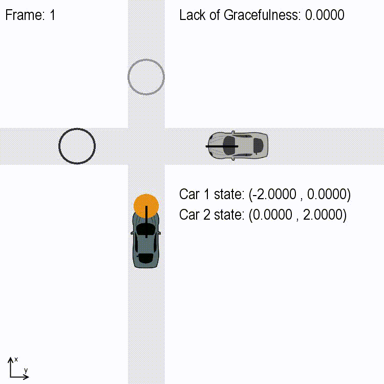

# Explicit Reasoning and Proactive Motion Planning towards Socially Graceful Autonomous Vehicles

Contributors: Steven Elliott, Yiwei Wang, Varun Jammula, Yi ren, Wenlong Zhang, Yezhou Yang

## Overview

The past decade has witnessed rapid advancement of autonomous driving since [the DARPA urban 
challenge](http://archive.darpa.mil/grandchallenge/). 
Till 2017, there were [44 large corporates](https://www.cbinsights.com/research/autonomous-driverless-vehicles-corporations-list/)
 across the world developing autonomous vehicles (
AVs). In the U.S., California and Arizona have allowed tests of AVs on public roads without human drivers. 
There are currently more than 600 AVs on the public roads in Arizona, including Alphabet's Waymo, 
who has started its [paid road-sharing services](https://www.azcentral.com/story/money/business/tech/2018/01/30/waymo-start-driverless-ride-sharing-phoenix-area-year/1078466001/)
 in Phoenix. Undoubtedly, AVs have the potential to enable 
faster and safer commute, improve road and fuel efficiency, and increase the accessibility of 
transportation for seniors and people with disabilities. They have become a key component for 
future smart cities. However, there is still a long way before AVs can reliably interact with 
pedestrians and other vehicles in a safe, efficient, and socially-graceful manner.

Incidents have been reported where AVs stopped indefinitely at traffic intersections, 
due to misunderstanding of the intent of [pedestrians](https://gizmodo.com/a-cyclists-track-stand-totally-befuddled-one-of-googles-1727024285)
 and [human drivers](https://jalopnik.com/google-is-training-self-driving-cars-to-mimic-human-dri-1733624021). 
 [The first claim](https://www.mercurynews.com/2018/01/23/motorcyclist-hit-by-self-driving-car-in-s-f-sues-general-motors/) against 
an AV manufacturer has been filed against General Motors in 2018, following a collision between 
a Cruise Automation 2016 Chevrolet Bolt and a motorcyclist, who alleged that the car swerved 
into his path without his agreement. Questions have also been raised regarding whether AV 
can reactive to and learn from actions such as 
[honking from other vehicles](http://theconversation.com/driverless-cars-might-follow-the-rules-of-the-road-but-what-about-the-language-of-driving-88824).

The common cause of these incidents is the lack of a mechanism for AVs to understand the 
"social norms" of driving. Such norms include the driving style (e.g., how much space between 
vehicles is considered as acceptable), the driving strategy (e.g., whether one should 
consider others' intents and driving styles during its motion planning), and tacit driving 
rules (e.g., [the "Pittsburgh left"](https://triblive.com/x/pittsburghtrib/sports/s_457936.html#axzz2SAfy5vRK): 
taking a left turn just as the light turns 
green). These norms are often region- and culture-dependent, and may 
change along time. We hypothesize that being cognizant about unique social norms in 
new environments will allow an AV to correctly model interactions, infer intents 
of other agents, and derive socially adept motions (e.g., graceful and legible). 

## From Honks to Socially Adept Motions
 
The objective of this project is to answer the following scientific questions 
towards the learning of social norms in driving: 

1. **Constitutive model of socially adept decision making?**: What formalism of decision making 
is capable of creating socially adept motions, provided that the model incorporates 
the correct social norms? 

2. **Artificial general intelligence?**: What learning mechanisms can effectively 
update this decision making model based on social feedback such as 
honking from other cars? 

To answer these questions, we build our 
investigation upon decision models that mechanistically derive vehicle 
motions through game-theoretic control, where the control games are 
formulated based on both real-time observations and learned social 
norms. We will then propose a hierarchical learning framework that updates 
the AV's game formulations, and thus its understanding of social norms, 
through semantic reasoning and data-driven learning.

This repo serves as the base for all codes, data, meta-data we create 
during the investigation.

## Constitutive model of socially adept decision making

To answer the first question, we investigate a formalism of motion planning that enables 
empathy and social awareness of an AV agent. Empathy is defined as the agent's ability 
to answer the question: ``What do others' think about me?'', or In other words, 
to infer others' intents in conjunction with their estimation of the agent's self intent. 
We show that empathy is critical to the correct inference of others' intents. 
Social awareness is defined as the agent's ability to measure the discrepancy 
between what it does and what others may want it to do, and the actions wanted 
by others are those that allow others to achieve high-payoff equilibrium in 
an interaction game. Thus social awareness is built upon empathy. We show 
that incorporating social awareness into motion planning enriches the 
sophisticacy of the agent, allowing it to create passive aggressive motions 
that are more socially graceful than proactive ones.

Details of the motion planning algorithms can be found in our [draft paper][maxpaper].

### The significance of empathy in interactions

### The influence of driving strategy on interactions
In the following, we demonstrate interactions between two agents (M and H) in a simple 
intersection scenario. The two agents are equipped with three 
different driving strategies, namely, reactive, proactive, and socially-aware:

* A *reactive* agent M plans based on the inferred distribution of future motions of the other agent H. 

* A *proactive* M exploits the fact that H's future motion are dependent on M's. 
In the intersection case, M will act as if it does not care about safety and force H to yield. 
However, when facing an aggressive H who does care less about safety, being proactive can 
cause M to brake abruptly when it realizes H's aggressiveness. 

* A *socially-aware* M is built upon the proactive model, with an additional goal of reducing 
the lack of gracefulness.

#### Non-aggressive reactive M vs. non-aggressive reactive H
Both agents take exactly the same actions at every time step since they share the same settings.
Both switch between fast and slow movements along time, since their observation of the other's slow (fast)
movement lead to their reaction of a fast (slow) movement. 

 

[maxpaper]: 